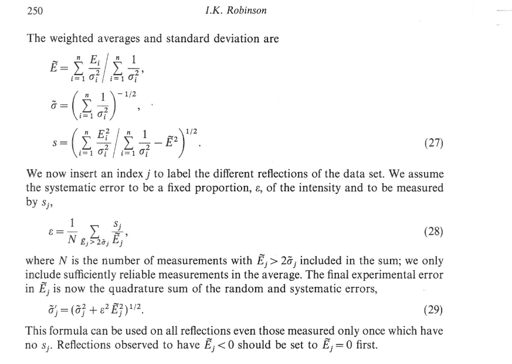

Symmetry averaging of data
==============================

To check the symmetry equivalents 
- make a dataset with just a few points from each rod - one point would be enough but might be easier to just copy a chunk. Then use this in AVE to do averaging to identify the symmetrical equivalent rods.
- Once you know the symmetry equivalents-  create separate datasets one for each set of symmetrically equivalent datasets. Run these through the AVE software, and these will give you the averaged CTR/FOR  to go into the full averaged data, and also an agreement factor epsilon.
- Once you have all of the averaged CTR/FORs you can combine them into a full datset, and then simply average the agreement factors to get the overall agreement factor for your dataset. 

 

Note that your structure factor error that you load into ROD needs to be calculated from your integrated intensity (I) using the functional approach:

:math:`SF_{error}=\sqrt{I-dI} - \sqrt{I} = \sqrt{I+\sqrt{I}} - \sqrt{I}`

Below is a screen shot from a book chapter that explains how the errors are calculated in AVE, here is the important section  

the full book chapter should be available as pdf here - https://www.ucl.ac.uk/~ucapikr/Robinson_HbkSyncRad_1991hr.pdf 
